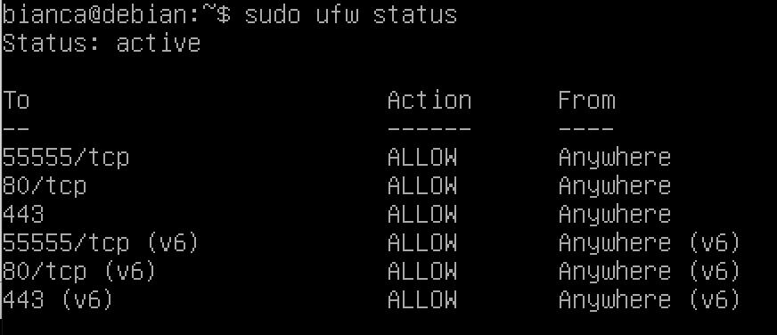
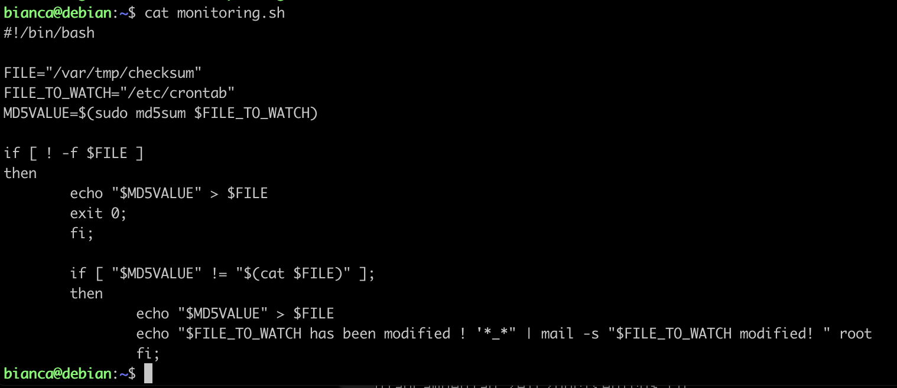

# roger-skyline-1
A Hive Helsinki project about installing a virtual machine and the basics of system and network administration.

## Setting up the Virtual Machine

We need a VM with a disk size of 8GB, that has at least one 4.2GB partition.
I set up the VM on VirtualBox with Linux OS, Debian 64-bit with a harddisk size of 8GB.
The `partition method` needs to be set up as `manual` to create the 4.2GB partition.

## Network and Security

__Tasks:__
- Create a non-root user to connect to the machine and work
- Use __sudo__ to be able to perform special rights operations
- Configure it to have a static __IP__ and a __Netmask__ in \30 (we dont want to use DHCP service)
- *SSH* access has to be done with __publickeys__
- Set rules of __firewall__ only with services used outside of VM
- You have to set a __DOS (Denial of Service Attack)__ protection on your open ports of your VM
- Set protection against scans on your VM’s open ports
- Stop services you dont need for this project
- Create __script__ that updates all the sources of package (scheduled task for this script once a week at 4AM and every time the machine reboots)
- Make a script to monitor changes of the /etc/__crontab__ file and sends an email to root if it has been modified (create a scheduled script task every day at midnight)

----
# 1.
When setting up the machine I created a non-root user. To access sudo with the non-root user we first
need to install the `sudo` command. For this we need to switch to the root by the `su` command.

Then we can install sudo and vim with the command:
```
$ apt-get install sudo vim -y
```
Tog give the non-root user sudo rights we need to add the user to the `/etc/sudoers` file.
`username ALL=(ALL:ALL)` should be added to the *# User priviliege specification* -section. Make sure you have the right access rights to write in the file (`chmod`).

Switch back from root user with `exit`.

---
# 2.

Next, we want to configure the machine to have a static IP and a netmask in \30.
In the VirtualBox settings, go to `Network->Attached to` and change from NAT to Bridged Adapter.

Then I edited the file `/etc/network/interfaces` with the primary network interface field like this:
```
#The primary network interface
auto enp0s3
```

After that I created a file called `enp0s3` in the `/etc/network/interfaces.d/` directory.
```
cat /etc/network/interfaces.d/enp0s3
```
```
iface enp0s3 inet static
      address 10.12.133.***
      netmask 255.255.255.252
      gateway 10.11.254.254
```
Then `sudo service networking restart` to make changes effective and then we can check
the ip with `ip addr`. You will see that the ip is the one set in the `/etc/network/interfaces.d/enp0s3` file!

After that we need to set the port we want in the file `/etc/ssh/sshd_config`. The row with Port need to be changed to what you want and made sure that it is not commented out (remove #).

Then
```
$ sudo service sshd restart
```

---
# 3.

Now it is time to set up the SSH access with publickeys. First, on the host machine that you want to connect from do:
```
ssh-keygen -t rsa
```
to generate the ssh key pair!

Then, let's copy the __public key__ from the host machine to the VM. That can be done with the command:

`ssh-copy-id -i id_rsa.pub bianca@10.12.133.*** -p 55555`

Next, let's edit the `sshd_config` file to deny root login and remove password authentication. Edit the following lines:
```
PermitRootLogin no
PubkeyAuthentication yes
PasswordAuthentication no
```
Remember to uncomment where needed (by removing the '#').

---
# 4.

We will set up the __Firewall__ using UFW, [Uncomplicated Firewall](https://wiki.ubuntu.com/UncomplicatedFirewall).

First we need to install UFW by `sudo apt-get install ufw`, then check the status with `sudo ufw status` if it's inactive we can enable it by `sudo ufw enable`.

Then it's time to allow some services

1. ssh connections through our chosen port `sudo ufw allow 55555/tcp`
2. incoming __http__ connections (port 80) `sudo ufw allow 80/tcp`
3. incoming __https__ connections (port 443) `sudo ufw allow 443`

The status of the firewall can be checked with the `sudo ufw status` command.



---
# 5.

Next up, __Fail2Ban__, to set up a __DOS__ (Denial of Service Attack). 

Let's first install Fail2Ban: `sudo apt-get install fail2ban`.

Then we need to copy the configuration file to edit it:
```
$ sudo cp /etc/fail2ban/jail.conf /etc/fail2ban/jail.local
```
Edit the jail.local file to have:

Under __SSH servers__ (protecting my chosen port 55555)

```
[sshd]
enable = true
port = ssh
logpath = %(sshd_log)s
backend = %(sshd_backend)s
maxentry = 3
bantime = 600
```

Under __HTTP servers__ (protecting port 80)
```
[http-get-dos]

enabled = true
port = http, https
filter = http-get-dos
logpath = %(apache_error_log)s
maxentry = 300
findtime = 300
bantime = 600
action = iptables[name=HTTP, port=http, protocol=tcp]
```

Let's also install iptables and apache `sudo apt-get install iptables apache2`

Then we create a file `/etc/fail2ban/filter.d/http-get-dos.conf` and add the text
```
[Definition]

failregex = ^ -.*GET
ignoreregex = 
```
Let's restart the services:
```
$ sudo ufw reload
$ sudo service fail2ban restart
```

You can check the status with `sudo fail2ban client status`.
Now, let's make a __SlowLoris__ attack to check that our configurations work. For that we need to install git.

Then we need to git clone the SlowLoris from github `git clone https://github.com/gkbrk/slowloris.git`.
And run the attack
```
cd slowloris
perl slowloris.py 10.12.133.***
```
---
# 6.

Let's set up a protection against __scans on open ports__ on our VM. 

```
$ sudo apt-get install portsentry
```
Then, modify the file `/etc/default/portsentry` to be:
```
TCP_MODE="atcp"
UDP_MODE="audp"
```
In `/etc/portsentry/portsentry.conf` under *Ignore Options*, change BLOCK_UDP and BLOCK_TCP to be 1 instead of 0. Under *Dropping Routes*, comment out all other KILL_ROUTE -lines except for the one under *iptables support for Linux*.

Restart the portsentry service with `sudo service portsentry restart`.

---
# 7.

Now it is time to __stop the services we don't need__. 

Let's check which services are running by `sudo service --status-all` / `sudo systemctl list-unit-files --type=service | grep enabled`.

I decided to disable the following services:
```
sudo systemctl disable keyboard-setup.service
sudo systemctl disable syslog.service
sudo systemctl disable console-setup.service
sudo systemctl disable apt-daily.timer
sudo systemctl disable apt-daily-upgrade.timer
```

---
# 8.

The next task is to create a script that updates all sources of package. This should happen once a week at 4AM and every time the machine reboots.

First, create a `.sh` file, then add the following lines to it
```
sudo apt-get update -y >> /var/log/filename.log
sudo apt-get upgrade -y >> /var/log/filename.log
```
Run, `sudo crontab -e` - and add the following lines to the crontab

```
@reboot /home/user/filename.sh &
0 4 ** MON /home/user/filename/sh &
```

Next we need to create a script to monitor changes to the /etc/crontab file and send an email to root if modified. This should happen every day at midnight.

Again, create a new `.sh` file. Add the following content:



We need to add the monitoring to crontab by `sudo crontab -e` and adding one last line
```
0 0 * * * /home/user/other_filename.sh
```
Then we need to install the mailutils to be able to check received mails. With the `mailx` command we can read the mail, it can also be found in `/var/mail/`.

```
$ sudo apt-get install mailutils
$ mailx
```

---
# 9.

Time to __deploy a web application__ with our VM IP!
Create your site inside the `/var/www/html/` folder and it should show up on your chosen ip address!

---
# 10.

In the last step, we need to create a self-signed SSL

I followed this step-by-step [guide](https://www.digitalocean.com/community/tutorials/how-to-create-a-self-signed-ssl-certificate-for-apache-in-ubuntu-16-04) to create the certificate.
